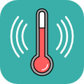
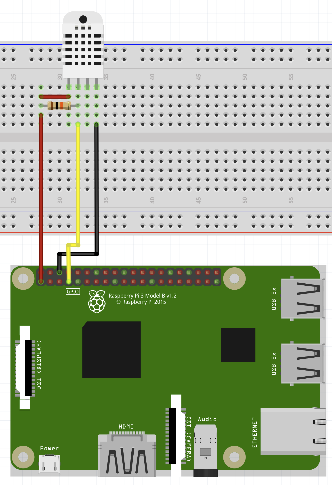

# Stream Temps 


Let your viewers know that you are sweating

## Requirements

 * Raspberry Pi 2, 3, or 4 with Raspberry Pi OS. You can find the setup video [here](https://www.youtube.com/watch?v=NAqBgF0swYo).
 * DHT-22 Sensor
 * Python Version `3.7.3+` installed

## Setup
### Hardware




*Raspberry Pi Pinout from: [https://www.raspberrypi.org/documentation/usage/gpio/](https://www.raspberrypi.org/documentation/usage/gpio/)*

### Bundle + Zip with PyInstaller

Bundling has to take place on a Raspberry Pi

```bash
make zip
```

### Command Line

```bash
python3 -m pip install -r requirements.txt
python3 stream_temps.py
```

## Credits
 Created by Konstantin (Konze) Lübeck

 * Discord: [discord.k0nze.gg](https://discord.k0nze.org) 
 * Twitch: [twitch.tv/k0nze](https://twitch.tv/k0nze) 
 * Youtube: [youtube.com/k0nze](https://youtube.com/k0nze) 
 * Twitter: [twitter.com/k0nze_gg](https://twitter.com/k0nze_gg) 
 * Instagram: [instagram.com/k0nze.gg](https://instagram.com/k0nze.gg) 
